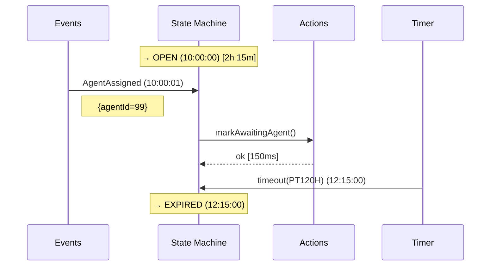

The admin UI is one of the biggest reasons to use this DSL instead of a raw Skipper workflow.
For any state machine instance — running, waiting, or completed — you get a single browser view
with the full lifecycle: current state, every state ever entered, every event ever received,
every transition attempt (including ignored ones, with the reason), pending timer deadlines, the
spans for every handler/hook/middleware call, an auto-generated Mermaid sequence diagram, and a
form for sending events to drive the machine manually.

It is **separate from** Skipper's own `/skipper/admin/` view, which shows raw workflow-level
action history. The state-machine view operates one level higher: it understands states, events,
transitions, and timers. Non-state-machine workflows redirect from the state-machine view back
to Skipper's admin.

## Why it matters for debugging

Debugging an event-driven workflow without an admin view usually means correlating log lines and
guessing at causality. With this view it is mechanical:

- **"Why did this event not move the state machine?"** — look at the event history row; the
  outcome column says `IGNORE_EXPLICIT`, `IGNORE_GUARD`, or `INVALID_NO_HANDLER`.
- **"When exactly did this transition happen?"** — the transition timeline shows wall-clock
  spans for every phase (handler, before-middleware, onExit, onEntry, after-middleware) of every
  transition attempt.
- **"What is this thing going to do next?"** — pending-timer deadlines show both the active
  `timeout` and every unfired `after` hook with their absolute deadline.
- **"Did the cleanup middleware run after that transition?"** — middleware spans are visually
  scoped to the transition that triggered them.

The Mermaid sequence diagram condenses all of the above into one chronological picture; it is
usually the fastest way to share what happened with a coworker (you can paste the markup
directly into a chat thread or PR description).

## Enabling the admin UI

Register `StateMachineAdminResource` (a JAX-RS resource) with your server alongside Skipper's own
`AdminResource`. Depend on the admin module and register the resource in your server's startup,
the same way you register Skipper's own admin resource — see the Installation section in the
[Overview](/docs/state-machine/overview/) for the dependency, and
[Observability](/docs/observability/) for how the admin views fit together.

## URLs

Once registered, the resource serves the following endpoints:

| Method | Path | Purpose |
|--------|------|---------|
| `GET` | `/skipper/admin/statemachines/` | HTML list view of state-machine workflow instances |
| `GET` | `/skipper/admin/statemachines/api/workflows/{id}` | JSON instance view (state history, event history, transition timeline, pending timers) |
| `GET` | `/skipper/admin/statemachines/api/workflows/{id}/valid-events` | JSON map of valid events per state with parameter schemas |
| `POST` | `/skipper/admin/statemachines/api/workflows/{id}/signal` | Send an event to a running state machine |

## Reading the instance view

The HTML view groups information into four sections:

- **Current state and pending timers** — what state the machine is in right now, when it entered,
  and which `timeout` and `after` deadlines are still pending.
- **State history** — every state the machine has entered, in order, with timestamps.
- **Event history** — every event that has arrived (including ignored ones, with the reason).
- **Transition timeline** — the ordered list of transition attempts, each with from/to states,
  trigger kind, outcome, and spans for the handler, hooks, and middleware.

The transition outcome column distinguishes:

| Outcome | Meaning |
|---------|---------|
| `TRANSITION_TO` | Handler returned `transitionTo(S)` — moved to a different state |
| `STAY` | Handler returned `stay()` — re-entered the same state |
| `IGNORE_EXPLICIT` | Handler returned `ignore()` |
| `IGNORE_GUARD` | A `on<E>(guard)` rejected the event |
| `INVALID_NO_HANDLER` | No handler matched the event in the current state |

This makes it easy to answer questions like "why did this event not move the state machine?" at
a glance.

## The Mermaid sequence diagram

The view also renders a Mermaid sequence diagram of the workflow's life so far. The diagram has
up to four participants, each appearing only if there are entries to show:

- **Timers** (left) — `after` hooks, `timeout` firings, and pending timer deadlines.
- **Events** — external signals arriving at the state machine.
- **State Machine** (center) — state entries shown as notes with durations.
- **Actions** (right) — checkpointed side effects with iteration and duration, including the
  framework's own middleware-record checkpoints.

Timestamps include the date (`MM-DD HH:mm:ss`) when the workflow spans multiple calendar days
(UTC); otherwise just the time (`HH:mm:ss`). A trimmed example:



## Sending an event from the admin UI

The `POST /api/workflows/{id}/signal` endpoint lets an operator manually drive a running state
machine. The request body uses fully qualified event class names and a JSON payload that matches
the event's constructor parameters:

```json
POST /skipper/admin/statemachines/api/workflows/TicketStateMachine-42/signal
Content-Type: application/json

{
  "eventClass": "com.example.tickets.statemachine.TicketEvent$AgentAssigned",
  "payload": { "agentId": 99 }
}
```

The endpoint validates the event against the machine's known event types (via
`/valid-events`) and returns 400 with a descriptive message if the class is unknown or the
payload does not match. On success it returns a small JSON status.

Use this for runbook scenarios: clearing a stuck reminder loop, forcing an escalation, sending a
synthetic event to test middleware behavior in production.

> **Important — access control:** the admin resource ships with no built-in authentication or
> authorization. It will be reachable by anyone who can reach the service. Production services
> should either limit its registration to non-production environments, place it behind an admin
> auth filter, or use the same access pattern your service uses for Skipper's own `AdminResource`
> (often: not exposed externally, reached by port-forwarding the service).

## Related dashboards

For service-wide metrics (workflow start rates, error rates, scheduler health), a Grafana
dashboard is the right place. See [Observability](/docs/observability/) for the link and access
instructions.

A typical setup pairs the service-wide dashboard for fleet-level health with the state-machine
admin UI for per-instance debugging.
